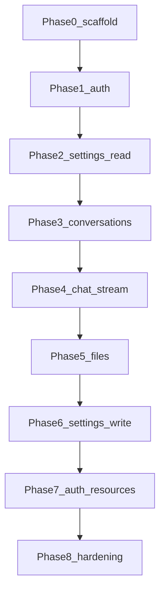

# Migration phases

Work items are ordered so each phase produces a **testable** increment. Dependencies: later phases assume earlier ones are done for the same environment (dev/staging).

Each task is labeled **Complete**, **In progress**, or **Not yet**.

## Phase 0 — Repository and contracts

**Phase status:** **Complete**.

- **Complete** — Create **`custom-web-ui/frontend/`** — Next.js app scaffold (TypeScript, App Router, lint/format), own `package.json`.
- **Complete** — Create **`custom-web-ui/backend/`** — Python API skeleton (FastAPI) with `GET /api/health`, structured to import `libs/ktem` from the repo.
- **Complete** — Add **`custom-web-ui/docker-compose.yml`** + **`custom-web-ui/nginx/nginx.conf`**: **nginx** is the only service with **published** host ports; **frontend** and **backend** are internal-only and reached via nginx (`/` → Next, `/api` → FastAPI). See [docker-compose-nginx.md](../architecture/docker-compose-nginx.md).
- **Complete** — Document env vars, build contexts, and run instructions in **`custom-web-ui/README.md`** (link [system-boundaries.md](../architecture/system-boundaries.md)).
- **Depends on:** nothing.
- **Unlocks:** parallel frontend/backend development and production-like integration tests behind nginx.

## Phase 1 — Auth stub + session

**Phase status:** **Not yet**.

- **Not yet** — API: `POST /api/auth/login` stub (or session cookie for `"default"` user when user management off).
- **Not yet** — API: `GET /api/auth/me`.
- **Not yet** — Next: middleware protecting `(main)` routes (redirect to `/login` when required).
- **Depends on:** Phase 0.
- **Unlocks:** realistic integration tests with credentials.

## Phase 2 — Settings read-only

**Phase status:** **Not yet**.

- **Not yet** — API: `GET /api/settings` returning flattened settings compatible with chat pipeline.
- **Not yet** — Next: optional debug page showing JSON (or omit UI until Phase 6).
- **Depends on:** Phase 1 (for authenticated request).
- **Unlocks:** chat can send `settingsSnapshot` matching Gradio.

## Phase 3 — Conversations CRUD (non-streaming)

**Phase status:** **Not yet**.

- **Not yet** — Extract `services/conversations.py` from [`chat/control.py`](../../libs/ktem/ktem/pages/chat/control.py).
- **Not yet** — API: list/create/patch/delete conversations.
- **Not yet** — Next: sidebar list + select conversation (empty chat area OK).
- **Depends on:** Phase 2.
- **Unlocks:** conversation-scoped chat testing.

## Phase 4 — Chat stream (MVP)

**Phase status:** **Not yet**.

- **Not yet** — Extract `prepare_user_turn` from `submit_msg` and `stream_reply` from `chat_fn` per [extraction-strategy.md](../backend-api/extraction-strategy.md).
- **Not yet** — API: SSE endpoint emitting token/info/plot/state/done events per [gradio-to-http-mapping.md](../architecture/gradio-to-http-mapping.md).
- **Not yet** — Next: chat page with streaming markdown + info panel shell.
- **Depends on:** Phase 3.
- **Unlocks:** core product demo without file index UI.

## Phase 5 — File index + chat integration

**Phase status:** **Not yet**.

- **Not yet** — API: upload, list, delete for primary file index.
- **Not yet** — Next: `/files` page + mention/autocomplete data for `@` references.
- **Not yet** — Wire index selections into chat turn payload.
- **Depends on:** Phase 4.
- **Unlocks:** RAG workflows end-to-end.

## Phase 6 — Settings write + LLM/embeddings/rerank CRUD

**Phase status:** **Not yet**.

- **Not yet** — API: `PATCH /api/settings` + resource endpoints from [endpoints-outline.md](../backend-api/endpoints-outline.md).
- **Not yet** — Next: `/settings` with sectioned forms; test connection buttons.
- **Depends on:** Phase 5 (chat stable enough to validate setting changes).
- **Unlocks:** operators can configure without Gradio.

## Phase 7 — Full auth + Resources + Help

**Phase status:** **Not yet**.

- **Not yet** — User management, admin-only routes, Resources tab parity ([auth-and-users.md](../features/auth-and-users.md)).
- **Not yet** — Help content page; first-setup wizard if enabled.
- **Depends on:** Phase 6.
- **Unlocks:** production-like access control.

## Phase 8 — Hardening and Gradio retirement

**Phase status:** **Not yet**.

- **Not yet** — Rate limits, logging, error shape consistency.
- **Not yet** — Load test SSE under concurrent users (through nginx with `proxy_buffering off` on SSE paths).
- **Not yet** — Remove or feature-flag `python app.py` for this deployment; document `launch.sh` replacement.
- **Not yet** — Verify production compose: only nginx exposes ports; backend and frontend not reachable from outside the Docker network.
- **Depends on:** Phase 7.
- **Unlocks:** single UI stack in production.

## Dependency graph (summary)

## Parallelization notes

- Phases 2 and 3 can overlap if two developers coordinate on settings DTO shape.
- UI polish (design tokens) can trail Phase 4 by one sprint using [design-system.md](../frontend/design-system.md).
